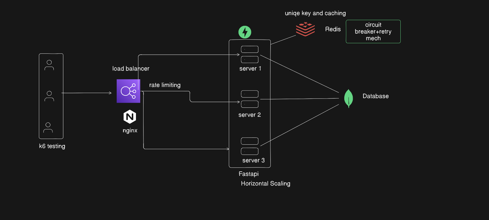

# 🚀 Scalable URL Shortener System

A production-style URL shortener built with **FastAPI, Redis, and MongoDB**, designed for **high performance, scalability, and resilience**.

---

## 📌 Overview

This project implements a scalable URL shortener capable of handling high concurrency using:

- ⚡ FastAPI (asynchronous backend)
- 🔥 Redis (caching, rate limiting, ID generation)
- 🗄️ MongoDB (persistent storage)
- 🌐 NGINX (load balancer)
- 📊 k6 (load testing)

---

## 🏗️ Architecture



---

## ⚙️ Tech Stack

| Component        | Technology |
|----------------|-----------|
| Backend        | FastAPI   |
| Cache          | Redis     |
| Database       | MongoDB (Beanie ODM) |
| Load Balancer  | NGINX     |
| Load Testing   | k6        |

---

## 🔥 Features

### ✅ URL Shortening
- Converts long URLs into short Base62 encoded URLs
- Ensures uniqueness using Redis counter

---

### ⚡ Redis Caching
- Cache-first approach for GET requests
- Reduces database load
- TTL-based expiration

---

### 🧠 Circuit Breaker + Retry
- Prevents cascading failures if Redis is unavailable
- Implements retry with exponential backoff

---

### 🚦 Rate Limiting
- Redis-based rate limiting
- Protects APIs from abuse

---

### 📈 Horizontal Scaling
- Multiple FastAPI instances
- Traffic distributed via NGINX

---

### 🗃️ Database Optimization
- Indexed fields (`shortUrl`, `longUrl`)
- Reduced redundant queries

---

## 📊 Performance

### 🧪 Latency (measured via curl)

| API  | Latency |
|------|--------|
| GET  | ~21–26 ms |
| POST | ~38–43 ms |

---

### 🚀 Load Testing (k6)

- ~600+ requests/sec (POST)
- Stable under concurrency
- Optimized using async I/O and connection pooling

---


---

## 📂 Project Structure
```
URL_SHORTNER/
│
├── app/
│   ├── core/
│   │   ├── circuit_breaker.py      
│   │   ├── redis.py               
│   │   ├── retry_safeRedis.py     
│   │
│   ├── Model/
│   │   └── shortner_model.py       
│   │
│   ├── Routes/
│   │   └── Routes.py               
│   │
│   ├── Database.py                
│   │   ├── main.py               
│   │   └── rate_limiter.py       
│
├── nginx-1.16.1/                  # NGINX setup (load balancer)
│
├── test/
│   ├── test1.js                   
│   │   └── test2.js              
│
├── architecture.png               
├── README.md                     
```


## ⚡ API Endpoints

### 🔹 Create Short URL

```http
POST /api/v1/url
Content-Type: application/json

{
  "longUrl": "https://example.com"
}
```

---

### 🔹 Redirect

```http
GET /api/v1/url/{shortUrl}
```

**Response:**
- `302 Redirect` to original URL


---

## 🧠 Key Learnings

- Designing scalable backend systems
- Handling high concurrency using async programming
- Implementing caching strategies
- Building resilient systems with circuit breaker + retry
- Load testing and performance optimization

---

## 🚀 Future Improvements

- Authentication & Authorization
- Custom short URLs
- Analytics (click tracking)
- Redis clustering
- Kubernetes deployment

---

## 👨‍💻 Author

Aditya Bhatnagar

---

## ⭐ Support

If you found this useful, consider giving this project a ⭐
